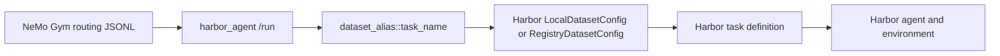

# Convert Dataset To Harbor + NeMo Gym Reference

## Mental Model

NeMo Gym and Harbor use two different dataset layers:

1. NeMo Gym routing dataset: JSONL rows consumed by `RolloutCollectionHelper`.
2. Harbor task dataset: dataset path or registry entry consumed by `harbor.job.Job`.

The routing row selects `harbor_agent`. The Harbor task dataset supplies the actual task.



## NeMo Gym Routing Row Schema

Minimal row:

```json
{"instance_id":"<dataset_alias>::<task_name>","responses_create_params":{"input":[]},"agent_ref":{"name":"harbor_agent"}}
```

Recommended fields:

```json
{
  "instance_id": "swe_verified::astropy__astropy-12907",
  "responses_create_params": {
    "input": []
  },
  "agent_ref": {
    "name": "harbor_agent"
  }
}
```

The `input` is often empty for Harbor tasks because the task instruction is loaded by the Harbor harness from the task dataset and later recovered from trajectory data.

## Harbor Config Template: Claude Code + Modal

Use this as a starting point:

```yaml
harbor_agent:
  responses_api_agents:
    harbor_agent:
      entrypoint: app.py
      domain: agent
      description: Harbor integration for agent harnesses and environments.
      value: Run Harbor agents through NeMo Gym.
      concurrency: 10

      harbor_datasets:
        swe_verified:
          local_dataset_path: "responses_api_agents/harbor_agent/data/swe_bench_verified_harbor"
          workdir: "/testbed"
          # Or use registry mode instead of local_dataset_path:
          # dataset_name: "swe-bench-verified"
          # dataset_version: null

      harbor_agent_name: "claude-code"
      harbor_agent_import_path: null
      harbor_agent_kwargs:
        max_turns: 100

      harbor_environment_type: "modal"
      harbor_environment_import_path: null
      harbor_environment_kwargs: {}

      model_server:
        type: responses_api_models
        name: policy_model

      harbor_agent_override_timeout: null
      harbor_agent_max_timeout: 1800
      harbor_verifier_override_timeout: null
      harbor_verifier_max_timeout: 900
      harbor_timeout_multiplier: null
      harbor_jobs_dir: "responses_api_agents/harbor_agent/jobs"
```

Do not layer this on top of the Singularity config unless explicitly overriding:

```yaml
harbor_environment_import_path: null
harbor_environment_kwargs: {}
```

## Harbor Config Template: Custom Agent Or Environment

Custom agent:

```yaml
harbor_agent_name: null
harbor_agent_import_path: "my_pkg.my_agent:MyAgent"
```

Custom environment:

```yaml
harbor_environment_type: null
harbor_environment_import_path: "my_pkg.my_env:MyEnvironment"
harbor_environment_kwargs:
  workdir: "/testbed"
```

Built-in agent or environment:

```yaml
harbor_agent_name: "claude-code"
harbor_agent_import_path: null
harbor_environment_type: "modal"
harbor_environment_import_path: null
```

## SWE-bench Verified Source Fields

Public dataset: `SWE-bench/SWE-bench_Verified`.

Common fields:

```text
instance_id
repo
base_commit
problem_statement
patch
test_patch
FAIL_TO_PASS
PASS_TO_PASS
version
environment_setup_commit
difficulty
```

Mapping:

| Source field | Routing JSONL | Harbor task dataset |
| --- | --- | --- |
| `instance_id` | `<alias>::<instance_id>` | task name |
| `problem_statement` | usually not needed | task instruction |
| `repo` | usually not needed | repo setup metadata |
| `base_commit` | usually not needed | repo checkout metadata |
| `test_patch` | usually not needed | verifier metadata |
| `FAIL_TO_PASS` | usually not needed | verifier metadata |
| `PASS_TO_PASS` | usually not needed | verifier metadata |
| task image | no | task `[environment]` |

## Task-wise Image Placement

Preferred location is the Harbor task definition:

```toml
[environment]
docker_image = "swebench/sweb.eval.x86_64.astropy__astropy-12907:latest"
```

If the image pattern is deterministic, generate it from `instance_id`. If an image is missing or ambiguous, do not choose a fallback silently. Ask the user whether to:

1. fail conversion for that datapoint,
2. use a provided fallback image,
3. generate/build the image,
4. keep the row but mark it for later image resolution.

## Conversion Algorithm

1. Load source rows.
2. Determine `dataset_alias`.
3. For each row, derive `task_name`.
4. Validate required fields.
5. Create or verify Harbor task definition for `task_name`.
6. Write one NeMo Gym routing row per source row.
7. Write or update Harbor config with `harbor_datasets[dataset_alias]`.
8. Validate counts and references.

Never drop rows during steps 3-6. Any unconvertible row requires a user decision.

## Local Code Anchors

Key local files:

- `Gym/responses_api_agents/harbor_agent/app.py`: `HarborAgentConfig`, `HarborAgent._build_job_config()`
- `Gym/nemo_gym/rollout_collection.py`: `RolloutCollectionHelper.run_examples()`
- `RL/nemo_rl/environments/nemo_gym.py`: `NemoGym.run_rollouts()`
- `Gym/responses_api_agents/harbor_agent/configs/harbor_agent.yaml`: Singularity example
- `Gym/responses_api_agents/harbor_agent/configs/harbor_agent_daytona.yaml`: built-in environment example

## Validation Commands

Use repository-appropriate commands when available. For lightweight validation, check:

- JSONL parses line by line.
- all `instance_id` values contain exactly one `::`.
- all task names are unique unless deliberate repeats are requested.
- local Harbor dataset contains every referenced task.
- generated config has no stale backend kwargs.

If validation finds missing data, ask the user. Do not skip the datapoint.
